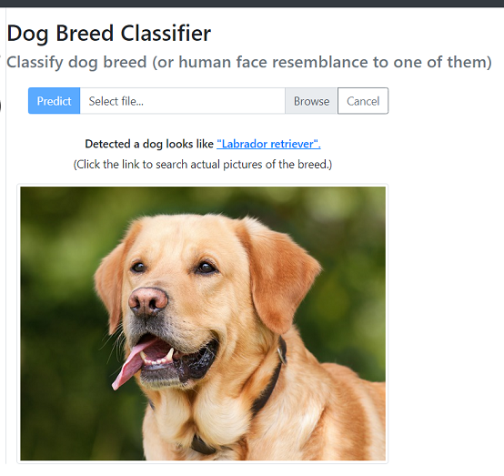

# Dog Breed Classification Project

### Overview
Dog breed classification model is built by transfer learning of Convolutional Neural Network. Base model is [ResNet-50](http://ethereon.github.io/netscope/#/gist/db945b393d40bfa26006) which had been trained on [ImageNet](http://www.image-net.org/) data. On top of the base model, simple classification layers are added. The classification part is re-trained on over six thousands dog breed pictures for 100 epochs. The trained model achieved accuracy score of 82.4% on test data set.

Web application is created with the above trained model. It is combined with human face detector that utilized OpenCV's implementation of [Haar feature-based cascade classifiers](http://docs.opencv.org/trunk/d7/d8b/tutorial_py_face_detection.html). So the application can detect dog breed as well as human face resemblance to one of them.

web app screenshot: 
 

### Libraries used in the project
- python==3.7.1
- Keras==2.1.0
- tensorflow==1.13.1
- Flask==1.0.2
- opencv-python==4.0.0.21
- Pillow==5.4.1

### Files in the repository
- [dog_app_model_creation.ipynb](dog_app_model_creation.ipynb) : Dog breed classification model creation process.
- webApp/ : Web application folder
  - app/ :
    - \__init__.py : package initialization
    - routes.py : routing script
    - wrangle_data.py : subroutines to make predictions
    - templates/
      - index.html : main HTML file
    - static/ : static contents folder (icon files)
  - data/ :
    - dogNames.pickle : dog breed name list
  - models/ :
    - haarcascade_frontalface_alt.xml : OpenCV's pre-trained face detector
    - weights.best.Resnet50.hdf5 : pre-trained top layer weights of dog breed classifier

### Model creation
For model creation, training, and testing process, please refer to [dog_app_model_creation.ipynb](dog_app_model_creation.ipynb).

### Web application
As a demonstration of this project result, web application is prepared under 'WebApp' folder. User can upload a jpeg image of a dog and predict dog breed. 

**Application launch** 
1. Move to 'WebApp' folder and run dog_web_app.py 
    `$ python dog_web_app.py`

2. Go to http://0.0.0.0:3001/
